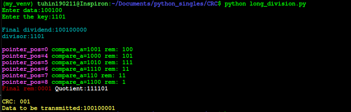

# CRC check in Networking

    CRC or the Cyclic redundancy check is the method of detecting accidental changes/errors in the communication channel. CRC uses a generator polynomial (or also referred to as a key) to validate the transfer or encode the data on receiver end or the sender's end.

    This key is available on both sides.

This program is an example of how we can encode and decode/validate the data on either side, given the key and the data to be transferred in their **binary form**.

## Implementations

**[Using Python:](long_division.py)**
___
### output:

___
[Using Java]()